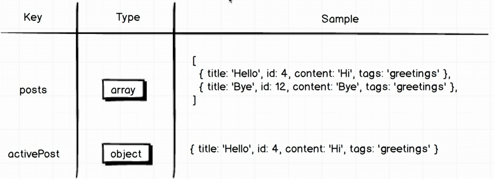

# React Blog

- Save and Retrive the Posts
- Navigate Users (React Router)
- Add Different Page
- Load Data from backend API based on user current Route
- Validation Form to POST data to a remote server

# How to Build this APP

### Redux Blog Post API Reference
[Post API](https://reduxblog.herokuapp.com/)

- POST Request API
```
POST Method
https://reduxblog.herokuapp.com/api/posts
```
```json
{
    "title": "Hi!",
    "categories": "Kevin",
    "content": "Kevin"
}
```
- GET Request API
```
GET Method
https://reduxblog.herokuapp.com/api/posts
```
```json
[
  {
      "id": 216869,
      "title": "Hi!",
      "categories": "Kevin",
      "content": "Kevin"
  },
  {
      "id": 216868,
      "title": "Hi!",
      "categories": "Kevin",
      "content": "Kevin"
  },
]
```
***

## React Router (Single Page Application)
No longer navigating between distinct HTML documents that are being created by some remote web server. Instead, we always deal with "single HTML document" and rely on the JavaScript code to chagne the set of components that a user sees apprearing on the screen. We're tracking the user and showing them different sets of components.

- Manage the URL and our appliaction.
```
npm install --save react-router-dom@4.0.0
```

- User clicks on some links to change the URL inside their browser.
- Browser said to the History Library and History wil run behind the server for us. To do some oarsing over it and figures out exactly what changed about the URL and pass it to React Router Library.
- React Router receive the new Route and updates the react component shown on the screen.
- React will rerender all components based on the new component.

#### BrowserRouter
Object is what interacts with the history library and decides exactly what to do based on the change of URL

#### Route
React Component that we can render inside of any other React Component inside our app (configuraion)

#### Render into ReactDOM
- Create Two Components to show how to use React Router
```js
class Hello extends React.Component{
  render(){return <div>Hello!</div>}
}

class GoodBye extends React.Component{
  render(){return <div>GoodBye!</div>}
}
```

```js
ReactDOM.render(
  <Provider store={createStoreWithMiddleware(reducers)}>
    <BrowserRouter>
      <div>
        <Route path = "/hello" component = { Hello } />
        <Route path = "/goodbye" component = { GoodBye}/>
      </div>
    </BrowserRouter>
  </Provider>
  , document.querySelector('.container'));
  ```

#### Root Route of App 
- What will be showed for users
```js
<Route path = "/" component = { PostIndex}>
```

#### Route for Patricular Posts of App
- Need to set up route configuration: wildcard -> colin id
```js
<Route path = "/posts/:id" component = { PostsShow }>
```

#### Route for Create Brand New Post
```js
<Route path = "/posts/new" component = { PostsNew }>
```

#### Delete App component
- Now we had a React Router, no longer need this app component anymore.


# State as an Object

- ActivePost is really a "duplicate piecce of state". Since the current route that a user is looking at is really another piece of state inside our application. Also, the ID that is reflected inside of that route or this particular route provides the exact same information as is being provided by ActivePost.
- Since we've already used :id to reflect the current state, we just need a state to handle the posts.
- When we had a URL, go back to see on the posts with that ID out of the list and show on the screen for users.
- Save as an Object -> key: id of Post / value: post itself : make it easy to find the post we fetched
```
Easy to look up:
state.posts[postId]
```


# Index Action
## Action Creator
- To fetch a list of posts and serve them up to our post index component

### Axios & Redux Promise
- Making Network Requests inside of an action creator.
- Handle asynchronous nature of the request itself.
- allpy Middleware "promise" intp index file
```js
const createStoreWithMiddleware = applyMiddleware(promise)(createStore);
```
### Build up a Request URL
- Given a ROOT_URL
- Given a Unique API_KEY
- Get a Request by axios

```js
import axios from 'axios';
export FETCH_POSTS = 'fetch_posts';

const ROOT_URL = 'https://reduxblog.herokuapp.com/api';
const API_KEY = '?key=weichien';

export function fetchPosts() {
  const request = axios.get(`${ROOT_URL}/posts${API_KEY}`);

  return {
    tyep: FETCH_POSTS,
    payload: request 
  }
}
```

# Post Reducer
- Produce the post piece of state to reutrn an Object
```js
const rootReducer = combineReducers({
    posts: PostsReducer
});
```
- Default the state as an Object
- Need a loadash libraries to take the array and create an Object

### _.mapKeys
- First Argument : an Array
- Second Argument : Property that we want to poll off of each object in here to use as the key on the resulting Objects.
```js
const posts = [
  { id: 4, title: "Hi"},
  { id: 5, title: "Hi There!"},
  { id: 33, title: "Hi Guy!"}
 ]
```
```js
_.mapKeys(posts,'id')
```
- Output will be likes
```js
{"4":{"id":4,"title":"Hi"},"5":{"id":5,"title":"Hi There!"},"33":{"id":33,"title":"Hi Guy!"}}
```
- Simple ID Lookup
```js
const state = _.mapKeys(posts,'id')
state["4"]
```
### Posts Reducer
```js
import { FETCH_POSTS} from '../actions';
import _ from 'lodash';

export default function(state = {}, action) {
  switch(action.type) {
    case FETCH_POSTS:
      return _.mapKeys(action.payload.data, 'id');
     
    default:
      return state;  

  }
}
```
